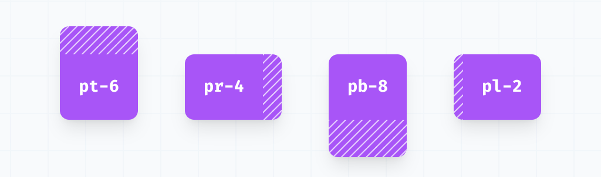

# Apuntes Tailwind
## Extensión VSC recomendada
Tailwind CSS IntelliSense
## Instalación
https://tailwindcss.com/docs/installation

Ver instalación por framework/librerias. La instalación a continuación es la "básica".
```
npm install -D tailwindcss
npx tailwindcss init
```
En el fichero ```tailwind.config.js``` hay que configurar las rutas a los ficheros "template" que utilizarán Tailwind.
```
/** @type {import('tailwindcss').Config} */
module.exports = {
  content: ["./app/**/*.{html,js}"],
  theme: {
    extend: {},
  },
  plugins: [],
}
```
En el fichero css principal añadir las directivas:
```
@tailwind base;
@tailwind components;
@tailwind utilities;
```
Iniciar build de Tailwind:
```
npx tailwindcss -i ./app/css/input.css -o ./app/css/output.css --watch
```
En el index.html o fichero correspondiente añadir enlace a al css construido:
```
<link href="./output.css" rel="stylesheet">
```
## Colores
En este enlace aparecen los colores y cómo configurarlos:
https://tailwindcss.com/docs/customizing-colors

Para background se pueden utilizar clases del tipo: **bg-lime-500, bg-black**... 

Para texto: **text-bamber-500, text-white**...

Para añadir un color en concreto en hexadecimal (si no lo vas a querer reutilizar): **bg-[#C0FFEE], text-[#E66]**...

Se pueden definir colores en ```tailwind.config.js``` de la siguiente manera:
```
En tailwind.config.js:
...
  theme: {
    extend: {
      colors: {
        'mi-color': '#B17'
      }
    },
  },
...

En html:
...
<p class="bg-mi-color"> Color personalizado en tailwind.config.js</p>
...
```
### Opacidad color
bg-lime-500/25
### Gradientes
https://tailwindcss.com/docs/gradient-color-stops
- Se especifica tipo de gradiente:
    - **bg-gradient-to-r**, de izquierda a derecha
    - **bg-gradient-to-l**, de derecha a izquierda
    - **bg-gradient-to-tr**, de abajo izquierda a arriba derecha.
    ...
- Se indica el color from **from-red-600**
- Se pueden indicar colores intermedios **via-blue-400**
- Se indica el color to **to-black**, si no se indica es a transparente.
- Se pueden indicar también las posiciones de los colores.

```
<p class="bg-gradient-to-r from-mi-color from-25% via-blue-300 via-70% to-black to-75%">Gradiente con posiciones</p>
```
### Gradientes en texto
Esto se puede conseguir haciendo una "máscara" del texto con el background. Gracias a las clases **bg-clip-text** y **text-transparent**
```
<div>
  <span class="text-5xl font-extrabold bg-clip-text text-transparent bg-gradient-to-r from-pink-500 to-violet-500">
    Texto con máscara del background
  </span>
</div>
```


## Margins, paddings, borders
### Padding, margin

Se pueden utilizar las siguientes clases:
- **p-5, m-5**: padding/margin general.
- **pt-1, mr-2, pb-8, ml-3** (top, right, bottom, left).
- **px-8**: padding/margin horizontal (left y right).
- **my-5**: padding/margin vertical (top y bottom).
- **mx-auto**: para centrar por ejemplo.

### Borders
- Definir borde: **border-1**
- Redondear: **rounded, rounded-md, rounded-xl**...
- color: **border-red-500**
### Outline
- definir outline: **outline**
- tamaño: **outline-2**
- color: **outline-black**
### ring
Similar a outline pero hecho a partir de box-shadow, más personalizable.
- definir ring y tamaño: **ring-1**
- color: **ring-purple-600**

### Sizing
- **w-24, w-96..., h-0, h-5**: tamaños para width y height predefinidos tailwind (ver documentación).
- **w-[170px]**: tamaños en pixels.
- **w-1/2**: tamaños proporcionales.
- **h-screen**: tamaño pantalla.
- **h-full**: tamaño del contenedor.

## Estados
- **hover:bg-lime-500**, cambia la clase cuando se produce el hover.
- **disabled:bg-red-200**, la clase se aplica si el input está disabled.
- **focus:border-red-500**, la clase se aplica cuando el elemento tiene el foco.
- **invalid:**, cuando el input no pasa validación.

## Pseudoclases


## Display
- **block**: el elemento pasa a tener display block.
- **flex**

## Otros
### Cursor
**cursor-pointer, cursor-wait, cursor-text**...
### peer
Para elementos hermanos
```
<input class="border border-gray-300 w-full px-3 py-2 rounded-md focus:outline-none focus:ring-1 focus:ring-purple-800 invalid:bg-red-600 peer" type="email" placeholder="Correo">
<p class="text-red-600 hidden peer-invalid:block">El correo es incorrecto</p>
```